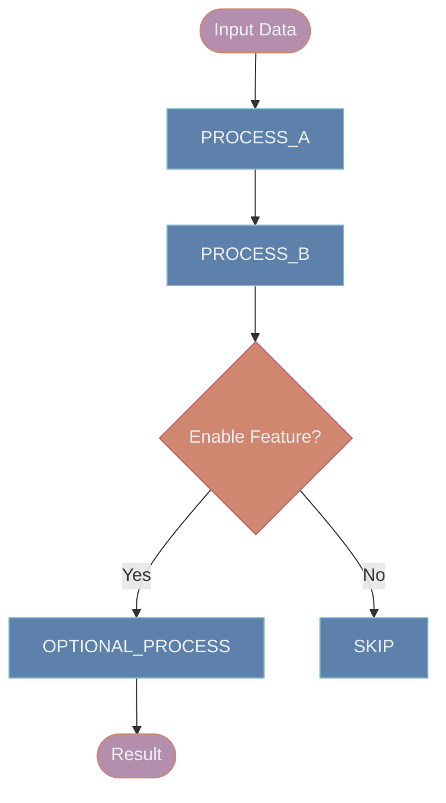
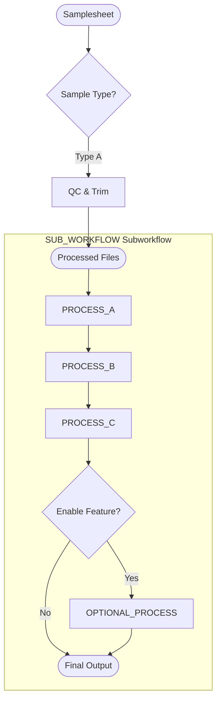
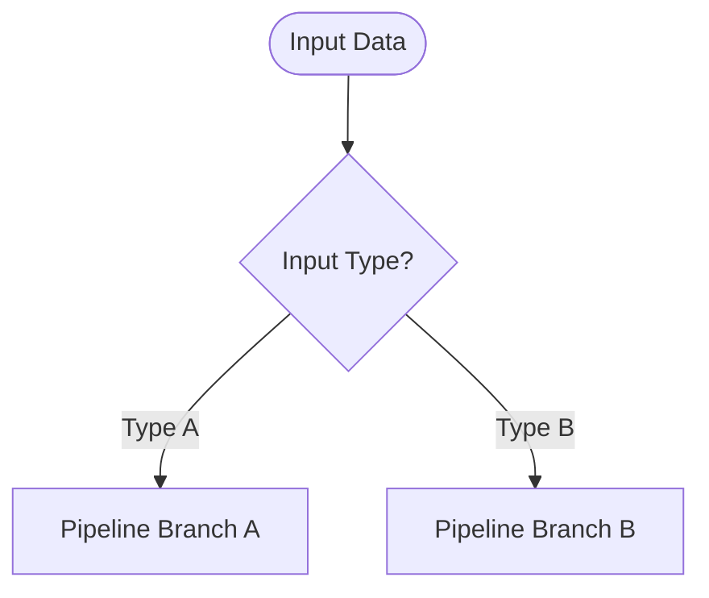
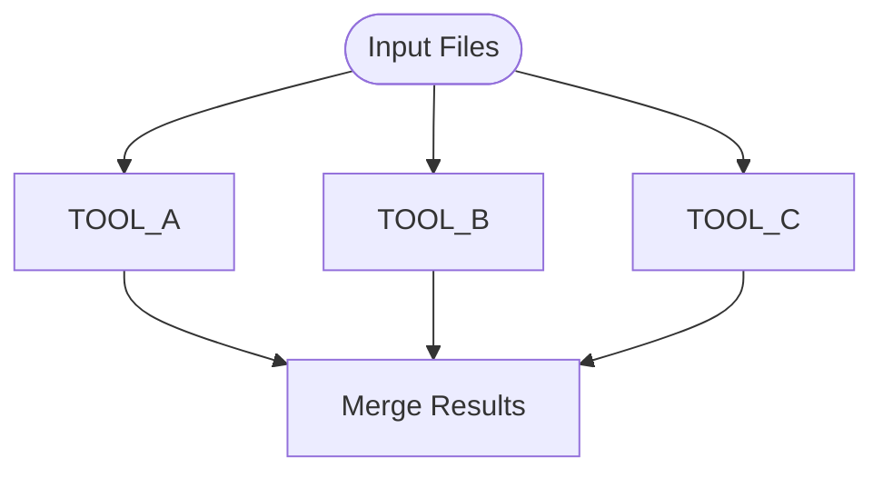
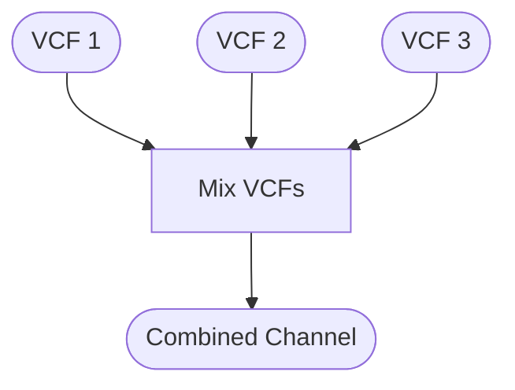
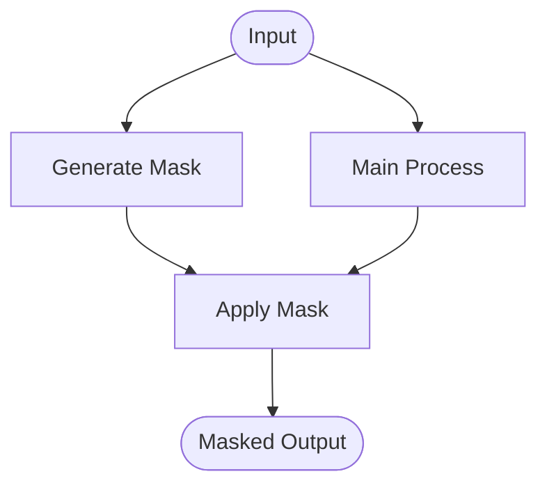
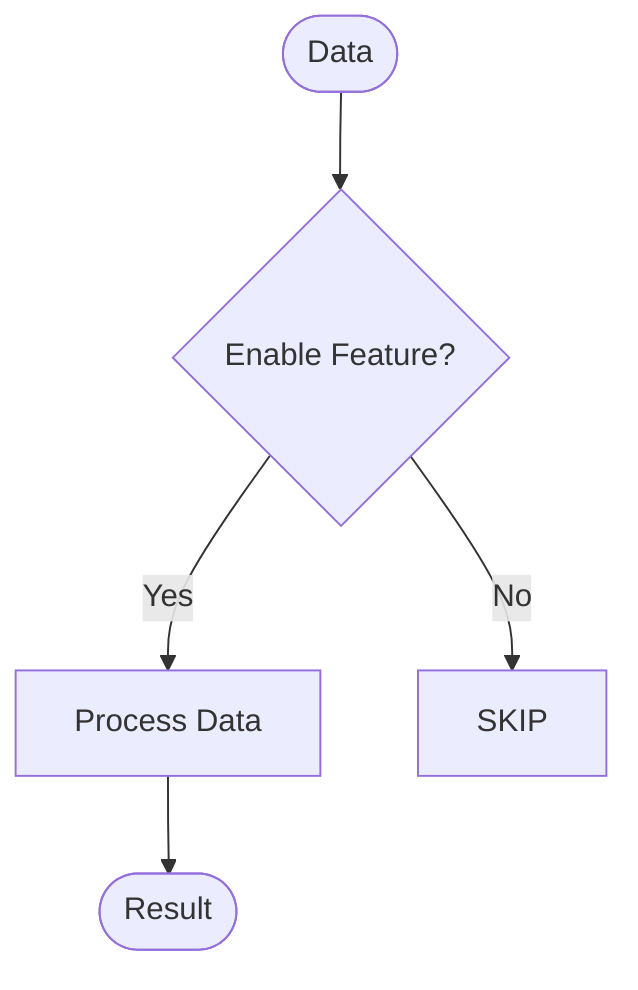
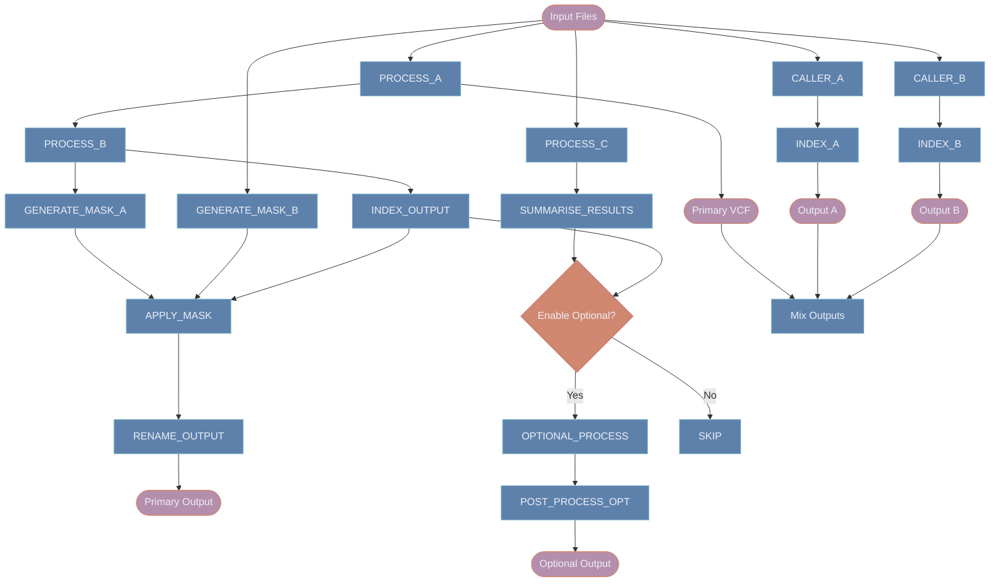

# Creating Pipeline Diagrams from Nextflow Code

## Overview

This skill guides you through analyzing Nextflow pipeline code and creating Mermaid diagrams that accurately represent the workflow structure, data flow, and decision logic.

## Diagram Standards

### Visual Conventions

Use consistent shapes and colors across all diagrams:

- **Stadium shapes** `([text])` for inputs and outputs (purple #b48ead)
- **Rectangles** `[text]` for processes (blue #5e81ac)
- **Diamonds** `{text}` for decision points (orange #d08770)

### Color Coding (via classDef)

Always include these class definitions at the end of your diagram:

```mermaid
classDef ioStyle fill:#b48ead,stroke:#d08770,color:#eceff4
classDef processStyle fill:#5e81ac,stroke:#88c0d0,color:#eceff4
classDef decisionStyle fill:#d08770,stroke:#bf616a,color:#eceff4

class InputNode,OutputNode ioStyle
class ProcessNode1,ProcessNode2 processStyle
class DecisionNode decisionStyle
```

### Diagram Types

- **Subworkflow diagrams**: Use `graph TD` (top-down flowchart)
- **Main pipeline diagrams**: Use `graph TD` with subgraphs for each subworkflow

## Analyzing Subworkflows

### Step 1: Identify the Workflow Structure

Read the subworkflow file (e.g., `subworkflows/local/<workflow_name>/main.nf`) and extract:

1. **Workflow name**: From `workflow WORKFLOW_NAME {`
2. **Inputs**: From the `take:` block
3. **Outputs**: From the `emit:` block
4. **Processes**: All `PROCESS_NAME()` calls in the `main:` block
5. **Decision points**: Conditional logic (if/else statements, when parameters)

### Step 2: Map the Data Flow

Trace how data flows through the workflow:

1. **Start with inputs**: Create input nodes using stadium shapes
2. **Follow process calls**: Each process becomes a rectangular node
3. **Track channel transformations**: Use `.map`, `.join`, `.mix` to understand connections
4. **Identify branches**: Look for parallel processing or conditional paths
5. **End with outputs**: Create output nodes using stadium shapes

### Step 3: Identify Decision Points

Look for:
- `if(parameter)` statements
- Conditional process execution
- Channel branching logic
- Optional pipeline sections

Create diamond-shaped decision nodes with labeled edges (e.g., `-->|Yes|`, `-->|No|`)

### Example Analysis

From `subworkflows/local/<workflow_name>/main.nf`:

```nextflow
workflow MY_WORKFLOW {
    take:
    input_data      // INPUT
    enable_feature  // PARAMETER
    
    main:
    PROCESS_A(...)             // PROCESS
    PROCESS_B(...)             // PROCESS
    
    if(enable_feature) {       // DECISION
        OPTIONAL_PROCESS(...)  // CONDITIONAL PROCESS
    }
    
    emit:
    result = ch_result         // OUTPUT
}
```

Becomes:



## Analyzing Main Pipeline (main.nf)

### Step 1: Identify High-Level Structure

1. **Pipeline sections**: Look for major workflow stages (QC, alignment, variant calling, etc.)
2. **Subworkflow calls**: Find all `SUBWORKFLOW_NAME()` invocations
3. **Technology or sample-type branches**: Identify distinct processing paths (e.g., different input types or platforms)
4. **Conditional sections**: Parameters that enable or disable pipeline stages (e.g., `run_qc`, `run_alignment`)

### Step 2: Use Subgraphs for Subworkflows

**CRITICAL**: When a subworkflow appears in main.nf, represent it as a subgraph that contains the COMPLETE workflow from its standalone diagram. The subgraph must include ALL processes, decisions, and data flow from the detailed subworkflow diagram.



**Important**: 
- Include ALL processes from the subworkflow, not just a simplified view
- Show ALL decision points and conditional logic
- Maintain the same node names as the standalone diagram
- Use `direction TB` (top-bottom) or `direction LR` (left-right) to control layout within the subgraph
- The subgraph box visually groups the subworkflow while maintaining full detail

### Step 3: Maintain Consistency

**Critical**: The flow inside subgraph boxes must match the standalone subworkflow diagram EXACTLY. This is not a simplified view - it is the complete workflow contained within a visual boundary.

### Step 4: Show Processing Branches

Use decision nodes to show distinct processing paths based on input type, platform, or parameter:



## Process Node Naming

### Simplification Rules

1. **Keep process names clear**: Use actual process names from the code
2. **Group similar processes**: If multiple indexes/conversions, consider grouping
3. **Show key transformations**: Highlight important data transformations
4. **Avoid clutter**: Don't show every intermediate step if it doesn't add clarity

### Examples

Good:
- `ALIGN_READS` → `ALIGN_READS`
- `SOME_TOOL as ALIAS_NAME` → `ALIAS_NAME`

Avoid:
- Overly generic names like `Process1`, `Process2`
- Including full Nextflow module paths

## Common Patterns

### Parallel Processing

Show multiple processes branching from the same input:



### Channel Mixing

Use a `Mix` node to show where channels are combined:



### Masking/Filtering

Show mask generation and application:



### Optional Branches

Always show both paths for optional processing:



## Best Practices

### Do's
✅ Analyze the entire workflow before starting the diagram
✅ Use consistent node shapes and colors
✅ Label decision edges clearly (Yes/No, Technology names, etc.)
✅ Keep input/output nodes at the top/bottom when possible
✅ Group related processes logically
✅ Show all major decision points
✅ Include classDef styling at the end
✅ Test your diagram with the renderer before finalizing

### Don'ts
❌ Don't include every minor channel transformation
❌ Don't use inconsistent node shapes
❌ Don't forget to classify nodes with colors
❌ Don't create overly complex diagrams - simplify when needed
❌ Don't show implementation details (e.g., `map`, `join` operations)
❌ Don't mix diagram styles (stick to `graph TD`)
❌ Don't forget the SKIP node for conditional branches

## Workflow Diagram Checklist

Before finalizing a diagram, verify:

- [ ] All inputs are shown with stadium shapes `([text])`
- [ ] All outputs are shown with stadium shapes `([text])`
- [ ] All processes are shown with rectangles `[text]`
- [ ] All decisions are shown with diamonds `{text}`
- [ ] Decision edges are labeled (|Yes|, |No|, etc.)
- [ ] classDef declarations are included
- [ ] All nodes are assigned to a class (ioStyle, processStyle, decisionStyle)
- [ ] Flow is clear and logical (top to bottom or left to right)
- [ ] Diagram renders successfully with theme-nord-dark.css
- [ ] Diagram matches the actual code logic

## Example Complete Workflow

The following illustrates a workflow with parallel processing paths, masking, optional branches, and channel mixing:



## Storage and Organization

Store diagrams in structured directories mirroring the pipeline layout:

```
docs/diagrams/
├── subworkflows/
│   ├── <subworkflow_name>/
│   │   ├── <subworkflow_name>.mmd
│   │   ├── <subworkflow_name>.svg
│   │   └── index.html
│   └── <other_subworkflow>/
│       ├── <other_subworkflow>.mmd
│       ├── <other_subworkflow>.svg
│       └── index.html
└── main/
    ├── main_pipeline.mmd
    ├── main_pipeline.svg
    └── index.html
```

## Next Steps

After creating a `.mmd` file:

1. **Render it** using the diagram-rendering skill
2. **Generate HTML documentation** for the diagram (see diagram-rendering skill)
3. **Review the diagram** with the rendered SVG
4. **Iterate** if the flow doesn't match the code exactly
